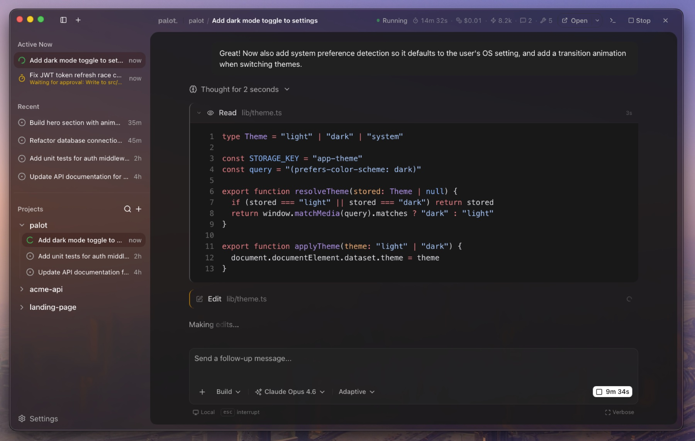

<picture>
  <source media="(prefers-color-scheme: dark)" srcset="apps/desktop/resources/brand/lockup-dark.png">
  <source media="(prefers-color-scheme: light)" srcset="apps/desktop/resources/brand/lockup-light.png">
  
</picture>

### A desktop GUI for [OpenCode](https://opencode.ai)

[](https://github.com/ItsWendell/codedeck/actions/workflows/ci.yml)
[](https://github.com/ItsWendell/codedeck/actions/workflows/release.yml)
[](https://github.com/ItsWendell/codedeck/releases)
[](https://github.com/ItsWendell/codedeck/releases)
[](LICENSE)

> **Alpha Software** -- Codedeck is under active development. Expect breaking changes, missing features, and rough edges. Feedback and contributions are welcome.

<p align="center">
  
</p>

---

Codedeck is an Electron-based desktop application that wraps [OpenCode](https://opencode.ai) with a visual interface for managing AI coding agent sessions across multiple projects. It spawns and manages the OpenCode server automatically, streams responses in real time, and renders tool calls with syntax-highlighted diffs, file previews, and terminal output.

<br>

## Features

**Multi-project workspace** -- Manage AI sessions across all your projects from a single window. OpenCode is scoped to one project per instance; Codedeck lifts that limitation.

**Full chat interface** -- Conversational UI with real-time SSE streaming, Markdown rendering, auto-scroll, lazy-load pagination, and draft persistence across session switches.

**Rich tool call visualization** -- Every tool call is rendered inline:
- **File reads** with line numbers and syntax highlighting
- **Edits** as inline diffs (old vs new)
- **Bash commands** with ANSI-colored terminal output
- **Search results** (glob, grep) with matched patterns
- **Web fetches** with URL and content preview
- **Task lists** with real-time progress tracking

**Sub-agent cards** -- Live activity cards for delegated tasks, with collapsible child session views and automatic collapse on completion.

**Model & agent selector** -- Searchable model picker across all connected providers (Anthropic, OpenAI, Google, and more), with reasoning variant support and a "last used" section. Switch between available agents (code, build, etc.).

**Permission management** -- Inline approve/deny UI for agent permission requests, with "allow once" and "allow always" options.

**Interactive questions** -- Radio, checkbox, and free-text input for agent questions, with keyboard shortcuts.

**File attachments** -- Drag-and-drop images (PNG, JPEG, GIF, WebP) and PDFs into the chat, with model capability warnings.

**Command palette** -- `Cmd+K` to search sessions, switch projects, and create new chats.

**Auto-updates** -- Built-in update mechanism with download progress and one-click restart.

<br>

## Platforms

| Platform | Architectures | Formats |
|----------|---------------|---------|
| macOS | Apple Silicon, Intel | DMG, ZIP |
| Windows | x64, ARM64 | NSIS installer |
| Linux | x64 | AppImage, DEB, RPM |

Download the latest release from the [Releases page](https://github.com/ItsWendell/codedeck/releases).

<br>

## Prerequisites

| Tool | Notes |
|------|-------|
| [Bun](https://bun.sh) 1.3.8+ | Runtime and package manager |
| [OpenCode CLI](https://opencode.ai) | Must be installed (`~/.opencode/bin/opencode`) |

OpenCode needs at least one AI provider configured (Anthropic, OpenAI, Google, etc.). Run `opencode` in a terminal once to complete initial setup.

<br>

## Getting Started

### From a release (recommended)

Download and install from the [Releases page](https://github.com/ItsWendell/codedeck/releases). Codedeck will automatically manage the OpenCode server.

### From source

```bash
# Clone and install
git clone https://github.com/ItsWendell/codedeck.git
cd codedeck
bun install

# Run the Electron app
cd apps/desktop && bun run dev
```

#### Browser-only mode (no Electron)

For frontend development without Electron:

```bash
# Terminal 1: Start the backend
cd apps/server && bun run dev     # port 3100

# Terminal 2: Start the renderer
cd apps/desktop && bun run dev:web  # port 1420
```

<br>

## Architecture

```
apps/
  desktop/       Electron 40 + Vite + React 19 desktop app
  server/        Bun + Hono backend (browser-mode dev only)
packages/
  ui/            Shared shadcn/ui component library (@codedeck/ui)
```

The desktop app has three runtime contexts:
- **Main process** (Node.js) -- Window management, IPC handlers, OpenCode server lifecycle
- **Preload** -- Secure bridge exposing `window.codedeck` API via `contextBridge`
- **Renderer** (Chromium) -- React app with components, hooks, services, stores

<br>

## Tech Stack

| Layer | Technology |
|-------|-----------|
| Desktop shell | Electron 40, electron-vite |
| Frontend | React 19, Vite 6, TypeScript |
| Styling | Tailwind CSS v4 |
| State | Zustand 5 |
| Routing | TanStack Router |
| Data fetching | TanStack React Query |
| UI components | shadcn/ui, Radix, cmdk |
| Code highlighting | Shiki |
| Diff rendering | @pierre/diffs |
| AI integration | @opencode-ai/sdk |
| Monorepo | Turborepo + Bun workspaces |
| Linting | Biome |
| Packaging | electron-builder |
| Versioning | Changesets |

<br>

## Commands

```bash
# Development
bun run dev              # Electron dev mode
bun run dev:web          # Browser-only dev mode (needs apps/server running)

# Build & package
bun run build            # Production build
bun run package          # Package for current platform
bun run package:all      # Package for all platforms

# Quality
bun run lint             # Lint with Biome
bun run lint:fix         # Lint and auto-fix
bun run format           # Format with Biome
bun run check-types      # Type-check all packages

# Versioning
bun changeset            # Add a changeset
bun run version-packages # Apply changesets and bump versions
```

<br>

## Contributing

Codedeck is in early alpha. If you'd like to contribute:

1. Fork the repository
2. Create a feature branch (`git checkout -b feature/my-feature`)
3. Add a changeset (`bun changeset`)
4. Open a pull request

Please run `bun run lint` and `bun run check-types` before submitting.

<br>

## License

MIT
