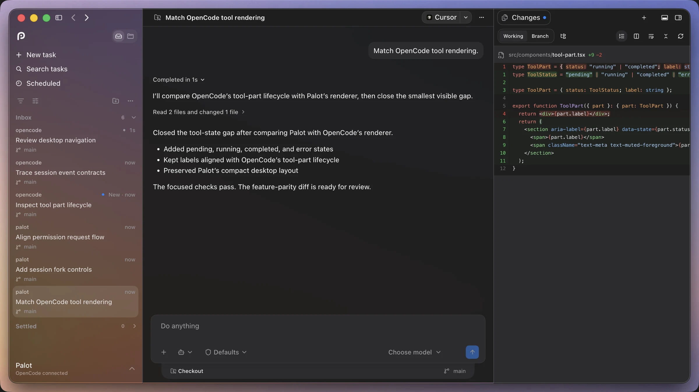

# Palot

Palot is an independent desktop client for OpenCode 2 on Linux and macOS. It is not
an official OpenCode project and is not affiliated with or endorsed by the
OpenCode maintainers.

Palot keeps OpenCode as the source of truth for projects, sessions, messages,
models, and tool execution. The desktop app adds a focused interface for
working across sessions, reviewing activity and changes, handling requests,
and managing local OpenCode connections.



## Status

**Palot v2**, introduced in 0.12.0, is a ground-up rebuild for OpenCode v2 and a breaking
upgrade from Palot 0.11.x. “Palot v2” names the rebuild; the application follows
the `0.x` SemVer release sequence. OpenCode has its own independent version.

Palot is open-source pre-release software under active development. The 0.12.1
release line adds Linux x64 and macOS Apple Silicon desktop packages. macOS
downloads are ad-hoc signed, not Apple Developer ID signed or notarized. Updates
are manual. See the installation guide's [platform matrix](docs/installation.md#platform-status)
for tested systems and limits.

Expect incomplete features, breaking changes, and release paths that have not
been qualified on clean supported machines. Startup recovery exists, but it is
still pre-release and should not be the only protection for important work.

The 0.12.0 release is source-only. Earlier 0.11.x downloads install the previous
application, not Palot v2.

## Install

Download a matching desktop asset and `SHA256SUMS` from
**[Releases](https://github.com/ItsWendell/palot/releases)**. Verify the file with
`sha256sum <file>` on Linux or `shasum -a 256 <file>` on macOS before installing.
If a release has no desktop assets, use the source instructions below.

| System                        | Package    | Install                                                       |
| ----------------------------- | ---------- | ------------------------------------------------------------- |
| Arch / other glibc Linux, x64 | AppImage   | `chmod +x ./<file>.AppImage`, then `./<file>.AppImage --show` |
| Fedora 43, x64                | RPM        | `sudo dnf install ./<file>.rpm`                               |
| Ubuntu 24.04, x64             | DEB        | `sudo apt install ./<file>.deb`                               |
| macOS, Apple Silicon          | DMG or ZIP | Copy `Palot.app` into Applications                            |

Linux also has a portable tar archive. Never run Palot as root or disable its
sandbox. Downloads don't require Bun or Node; Palot prefers your installed
OpenCode and offers an explicit official download if you need one.

On macOS, approve the verified app in **System Settings → Privacy & Security →
Open Anyway** if prompted. Optional local self-signing, after installing Command
Line Tools with `xcode-select --install`:

```sh
codesign --force --timestamp=none --sign - /Applications/Palot.app
codesign --verify --deep --strict /Applications/Palot.app
```

This isn't Apple notarization and may still require per-app approval. See the
[installation guide](docs/installation.md#desktop-release-packages) for package
verification, dependencies, signing, updates and removal.

## Local service lifecycle

Palot connects to the registered local OpenCode service by default. Opening Palot,
retrying a connection, or recovering a disconnected event stream does not start,
replace, or upgrade that service. If no reachable service is found, use **Start
OpenCode** and review the confirmation: the official startup API can also recover
an unresponsive service, which may interrupt other connected clients. Restarting
or replacing a service version requires a separate confirmed action.

An existing user-installed OpenCode runtime is preferred for explicit local
startup. Connection settings let you choose an installation, check the Stable or
Beta channel, and explicitly update it using OpenCode's npm, Bun, pnpm, Yarn or
curl upgrade support. Updating the executable does not restart the service.
Desktop installers do not bundle OpenCode. If you don't have it installed, setup
can explicitly download a verified fallback directly from opencode.ai into
Palot's application data, without changing your global installation. A service started by Palot is still
shared with other OpenCode clients; closing Palot leaves it running.
Remote and SSH profiles do not fall back to local startup. Automatic shared-service
startup and a separate isolated managed profile are not currently offered.

## Install from source

Start with the **[installation guide](docs/installation.md)** for Arch Linux,
Fedora, Ubuntu, and macOS prerequisites, pinned Bun/Vite+ setup, and the exact
development CLI version. It also covers updating, uninstalling, and local macOS
self-signing without weakening Gatekeeper.

| Platform       | Start here                                                                                                                                     |
| -------------- | ---------------------------------------------------------------------------------------------------------------------------------------------- |
| Arch / Omarchy | [Pacman prerequisites and user-local or local package installation](docs/installation.md#arch-linux--omarchy-rolling-x86_64)                   |
| Fedora 43      | [DNF prerequisites and desktop setup](docs/installation.md#fedora-43-workstation-x86_64)                                                       |
| Ubuntu 24.04   | [APT prerequisites and per-app sandbox setup](docs/installation.md#ubuntu-2404-lts-desktop-amd64)                                              |
| macOS          | `xcode-select --install`, then [native prerequisites and self-signing](docs/installation.md#macos-local-self-signing-and-nightly-installation) |

With the pinned [Bun and Vite+ toolchain](docs/installation.md#2-clone-and-bootstrap-the-toolchain)
available, install project dependencies using `vp install --frozen-lockfile`.

After cloning and completing that setup, run from the repository root:

```sh
# Linux: build, verify, install for your user, and launch Nightly
bun run install:nightly:linux

# macOS: one-time local signing identity (requires OpenSSL 3)
bun run setup:signing:mac
# Then build, verify, locally sign, install, and launch
bun run install:nightly:mac

# Or Linux/macOS: launch the development app in the foreground
bun run dev:focus
```

Source builds require Bun `1.4.2`, Node.js `24` or later, and Vite+. Stable OpenCode
**2.x starting at 2.0.7** is supported as an external service; the client and
release-smoke runtime are pinned to **2.0.9**. V2 betas require explicit consent.
See [runtime compatibility](docs/opencode-runtime.md#compatibility) before upgrading.
`bun run dev` starts hidden; `bun run dev:visible` shows the window without taking
focus. Windows is not a qualified installation target.

On macOS, the signing script creates a local certificate and changes trust in
your user keychain; review it first and run it in an interactive Terminal. It
does **not** provide Apple Developer ID signing or notarization. If you use
Homebrew, `brew install openssl@3` provides the required signing tool; the guide
shows the scoped PATH command. Never disable Gatekeeper or run the build as root.

### Upgrading from 0.11.x

Back up important work and configuration before switching. The new app requires
OpenCode v2; a V1 server is not compatible. Follow the
[official OpenCode migration guide](https://opencode.ai/v2/docs/migrate-v1) for
OpenCode-owned data and configuration. Palot settings, plugins, installation
paths and workflows from 0.11.x are not all guaranteed to carry over. Existing
0.11.x binary downloads are legacy releases, not builds of this source tree.

## Privacy

Palot does not currently include usage analytics, crash reporting, or telemetry
that sends data to Palot maintainers. It stores app settings, local logs, and
some Palot-owned state on the device. Prompts, repository context, model
requests, and tool activity are handled by the OpenCode service and providers
you configure.

Read [PRIVACY.md](PRIVACY.md) before using Palot with sensitive repositories or
remote OpenCode servers.

## Contributing and support

- [Contributing](CONTRIBUTING.md)
- [Documentation index](docs/README.md)
- [Support](SUPPORT.md)
- [Security policy](SECURITY.md)
- [Accessibility](ACCESSIBILITY.md)
- [GitHub Issues](https://github.com/ItsWendell/palot/issues)
- [GitHub Discussions](https://github.com/ItsWendell/palot/discussions), planned
  but currently disabled

Palot-authored code is licensed under the [MIT License](LICENSE). Vendored code,
skills and assets retain their applicable licenses and notices; see
[third-party notices](apps/desktop/resources/licenses/THIRD_PARTY_NOTICES.md).
See [TRADEMARKS.md](TRADEMARKS.md) before publishing a fork or distribution using
the Palot name or branding.
